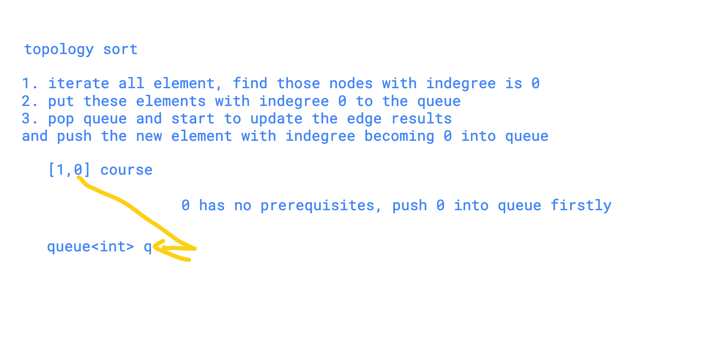

# Course Schedule I and II


#### Description

中文English

There are a total of n courses you have to take, labeled from `0` to `n - 1`.

Some courses may have prerequisites, for example to take course 0 you have to first take course 1, which is expressed as a pair: \[0,1\]

Given the total number of courses and a list of prerequisite pairs, is it possible for you to finish all courses?Have you met this question in a real interview?  YesProblem Correction

#### Example

Example 1:

```text
Input: n = 2, prerequisites = [[1,0]] 
Output: true
```

Example 2:

```text
Input: n = 2, prerequisites = [[1,0],[0,1]] 
Output: false
```

#### Related Problems

[815. Course Schedule IV](https://www.lintcode.com/problem/course-schedule-iv)[696. Course Schedule III](https://www.lintcode.com/problem/course-schedule-iii)[616. Course Schedule II](https://www.lintcode.com/problem/course-schedule-ii)[127. Topological Sorting](https://www.lintcode.com/problem/topological-sorting)

```cpp
class Solution {
public:
    /*
     * @param numCourses: a total of n courses
     * @param prerequisites: a list of prerequisite pairs
     * @return: true if can finish all courses or false
     */
    bool canFinish(int numCourses, vector<pair<int, int>>& prerequisites) {
        // write your code here
        
         int nSize = prerequisites.size();
        if (nSize == 0)
            return true;
        
        vector<int> nIndegree(numCourses, 0);
        vector<vector<int>> Graph(numCourses);
        queue<int> sources;
        for (int i = 0; i < nSize; i++) {
            nIndegree[prerequisites[i].first]++; 
            Graph[prerequisites[i].second].push_back(prerequisites[i].first);
        }
        for (int i = 0; i < numCourses; i++) {
            if (nIndegree[i] == 0)
                sources.push(i);
        }
        
        int nTotal = 0;
        while (!sources.empty()) {
            int nTmp = sources.front();
            sources.pop();
            int nEdges = Graph[nTmp].size();
            for (int i = 0; i < nEdges; i++) {
                nIndegree[Graph[nTmp][i]]--;
                if (nIndegree[Graph[nTmp][i]] == 0)
                    sources.push(Graph[nTmp][i]);
            }
            nTotal++;
        }
        
        if (nTotal == numCourses)
            return true;
        else
            return false;
    }
};
```


#### Description

中文English

There are a total of n courses you have to take, labeled from `0` to `n - 1`.  
Some courses may have prerequisites, for example to take course 0 you have to first take course 1, which is expressed as a pair: `[0,1]`

Given the total number of courses and a list of prerequisite pairs, return the ordering of courses you should take to finish all courses.

There may be multiple correct orders, you just need to return one of them. If it is impossible to finish all courses, return an empty array.Have you met this question in a real interview?  YesProblem Correction

#### Example

Example 1:

```text
Input: n = 2, prerequisites = [[1,0]] 
Output: [0,1]
```

Example 2:

```text
Input: n = 4, prerequisites = [1,0],[2,0],[3,1],[3,2]] 
Output: [0,1,2,3] or [0,2,1,3]
```

```cpp
class Solution {
public:
    /*
     * @param numCourses: a total of n courses
     * @param prerequisites: a list of prerequisite pairs
     * @return: the course order
     */
    vector<int> findOrder(int numCourses, vector<pair<int, int>> &prerequisites) {
            vector<int> res;
            if (numCourses <= 0) return res;
            
            //degree and graph
            vector<int> degree(numCourses,0);
            vector<vector<int>> graph(numCourses);
            
            for (auto v : prerequisites){
                degree[v.first]++;
                graph[v.second].push_back(v.first);
            }
            
            queue<int> source;
            for (int i = 0; i < numCourses; i++){
                if (degree[i] == 0){
                    source.push(i);
                    res.push_back(i);
                }
            }
            
            while(!source.empty()){
                int c  = source.front(); source.pop();
                
                int size = graph[c].size();
                for(int i = 0; i < size; i++){
                    degree[graph[c][i]]--; 
                    if (degree[graph[c][i]] == 0){
                        source.push(graph[c][i]);
                        res.push_back(graph[c][i]);
                    }
                }
            }
            
            for (auto v : degree){
                if (v > 0 ){
                    vector<int> empty;
                    return empty;
                }
            }
            return res;
    }
};
```

**Topology sort**

```cpp
class Solution {
public:
    /*
     * @param numCourses: a total of n courses
     * @param prerequisites: a list of prerequisite pairs
     * @return: the course order
     */
    vector<int> findOrder(int numCourses, vector<pair<int, int>> &prerequisites) {
        // write your code here
        
        vector<int> ret;
         vector<int> empty;
        // course prerequisites
        map<int, set<int> > cond; 
        
        // course learned ==> can learn course
        map<int,set<int>> courseRecord; 
        
        for (auto p : prerequisites){
            cond[p.first].insert(p.second);
            courseRecord[p.second].insert(p.first);
        }
        
        queue<int> q;
        for (int i = 0; i < numCourses; i++){
            if (cond.find(i) == cond.end()){
                q.push(i);
            }
        }
        
        while(!q.empty()){
            int course = q.front(); q.pop();
            ret.push_back(course);
            
            if (courseRecord.find(course) != courseRecord.end()){
                for( auto v : courseRecord[course]){
                    if (cond.find(v) != cond.end()){
                        cond[v].erase(course);
                        if (cond[v].size() == 0){
                            q.push(v);
                        }
                    }
                }
            }
        }
        return ret.size() == numCourses ? ret : empty;
    }
};
```




