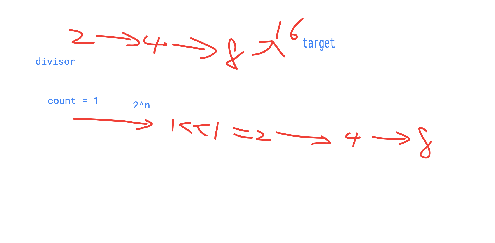

# 414. Divide Two Integers


This is the problem you have done. Do you remember how to solve it?Of CourseOnce Again

#### Description

中文English

Divide two integers **without using multiplication, division and mod operator.**

If it will overflow\(exceeding 32-bit signed integer representation range\), return `2147483647`Have you met this question in a real interview?  YesProblem Correction

#### Example

**Example 1:**

```text
Input: dividend = 0, divisor = 1
Output: 0
```

**Example 2:**

```text
Input: dividend = 100, divisor = 9
Output: 11
```

Notes:

every time, we only to double the divisor to each the target more quickly



```cpp
/**
 * @param dividend: the dividend
 * @param divisor: the divisor
 * @return: the result
 */
 import(
     "math"
    //  "fmt"
     )
 
func divide (dividend int, divisor int) int {
	// write your code here
	if dividend == 0 {
		return 0
	}
	if dividend == divisor {
		return 1
	}

	index := 1
	if dividend > 0 && divisor < 0 ||
		dividend < 0 && divisor > 0 {
		index = -1
	}

	dividend = int(math.Abs(float64(dividend)))
	divisor = int(math.Abs(float64(divisor)))
	
	ret := 0
	
	for dividend >= divisor {
	    temp := divisor 
	    doubles := 1;
	    
	    //divisor * 2, divisor*4, each time double the 
	    //divisor to reach the target dividend number more quickly
        for( (temp << 1)  <= dividend) {
            temp <<= 1;
            doubles <<= 1;
        }
        
        dividend -= temp;
        ret += doubles;
	}
	if index * ret > 2147483647{
	    return 2147483647
	}
	return index * ret
}

```

