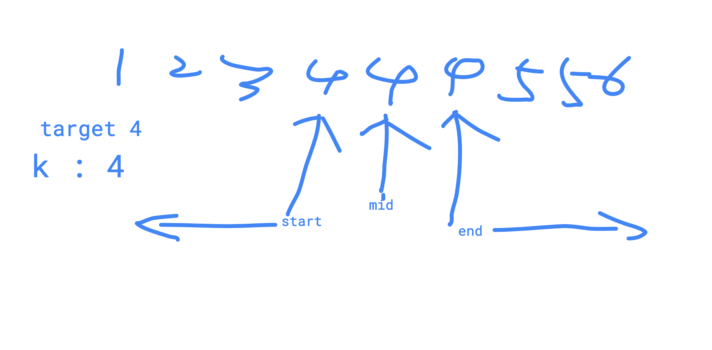
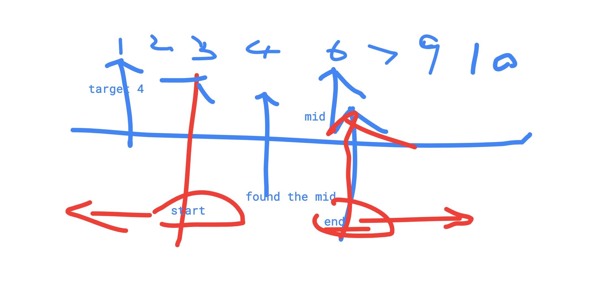

# 460 Find K Closest Elements


#### Description

中文English

Given `target`, a non-negative integer `k` and an integer array `A` sorted in ascending order, find the `k` closest numbers to `target` in `A`, sorted in ascending order by the difference between the number and target. Otherwise, sorted in ascending order by number if the difference is same.

1. The value `k` is a non-negative integer and will always be smaller than the length of the sorted array.
2. Length of the given array is positive and will not exceed 10^410​4​​
3. Absolute value of elements in the array will not exceed 10^410​4​​

Have you met this question in a real interview?  YesProblem Correction

#### Example

**Example 1:**

```text
Input: A = [1, 2, 3], target = 2, k = 3
Output: [2, 1, 3]
```

**Example 2:**

```text
Input: A = [1, 4, 6, 8], target = 3, k = 3
Output: [4, 1, 6]
```

#### Challenge

O\(logn + k\) time

#### Related Problems

[612. K Closest Points](https://www.lintcode.com/problem/k-closest-points)[459. Closest Number in Sorted Array](https://www.lintcode.com/problem/closest-number-in-sorted-array)

Notes:

two different cases,

the target is in the array,

the target is not in the array,

we should find the start index and end index which are closest to target or equal to target, then we iterate from two sides. 





```cpp
/**
 * @param A: an integer array
 * @param target: An integer
 * @param k: An integer
 * @return: an integer array
 */
 
import("math")

func kClosestNumbers (A []int, target int, k int) []int {
    
    res := make([]int,0)
        
    // write your code here
    if k == 0 || len(A) == 0 {
        return res
    }

    
    start := 0
    end := len(A) - 1
    
    for start + 1 < end{
        mid := (start + end) / 2 
        if A[mid] == target{
            start = mid -1 
            end = mid  + 1
            res = append(res, target)
            break
        }else if (A[mid] > target){
            end = mid
        }else{
            start = mid
        }
    }
    
    for len(res) < k {
        if (start >= 0 && end < len(A)){
            if math.Abs(float64(A[start] - target)) <= math.Abs(float64(A[end] - target)){
                res = append(res,A[start])
                start--
            }else{
                res = append(res,A[end])
                end++
            }
        }else if start >= 0{
                res = append(res,A[start])
                start--          
        }else if end <len(A) {
                res = append(res,A[end])
                end++               
        }
    }
    return res
}

```

