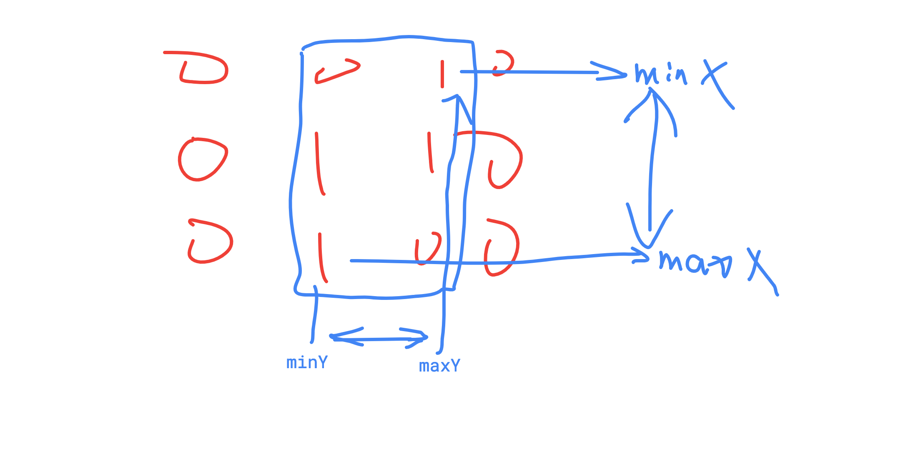

# 600 Smallest Rectangle Enclosing Black Pixels

#### Description

中文English

An image is represented by a binary matrix with `0` as a white pixel and `1` as a black pixel. The black pixels are connected, i.e., there is only one black region. Pixels are connected horizontally and vertically. Given the location `(x, y)` of one of the black pixels, return the area of the smallest \(axis-aligned\) rectangle that encloses all black pixels.Have you met this question in a real interview?  YesProblem Correction

#### Example

For example, given the following image:

```text
[
  "0010",
  "0110",
  "0100"
]
```

and x = `0`, y = `2`,  
Return `6`.

Notes:

BFS , find the corner black pixel



```cpp
/**
 * @param image: a binary matrix with '0' and '1'
 * @param x: the location of one of the black pixels
 * @param y: the location of one of the black pixels
 * @return: an integer
 */
// import("fmt")
 
func minArea (image [][]byte, x int, y int) int {
    // write your code here
    m := len(image)
    if m == 0 {
        return 0
    }
    
    n := len(image[0])
    
    if n == 0 {
        return 0
    }
    
    minX := m + 1 
    maxX := -1
    
    minY := n + 1 
    maxY := -1
    
    data := make([][]int,m)
    for i:= 0 ; i < m; i++{
        data[i] = make([]int,n)
    }
    
    var queue [][2]int 
    queue = append(queue,[2]int{x,y})
    
    for len(queue) > 0 {
        
        size := len(queue)
        
        for i := 0 ; i < size; i++ {
            tmp := queue[i]
            row := tmp[0]
            col := tmp[1]
            
            if minX > row{
                minX = row
            }
            if maxX < row{
                maxX = row
            }
            
            if minY > col{
                minY = col
            }
            if maxY < col{
                maxY = col
            }
            
            if row + 1 < m && image[row+1][col] == '1' && data[row+1][col] == 0{
                data[row+1][col] = 1 
                queue = append(queue,[2]int{row+1, col})
            }
            
            if row - 1 >= 0 && image[row-1][col] == '1' && data[row-1][col] == 0{
                data[row-1][col] = 1 
                queue = append(queue,[2]int{row-1, col})
            }
            
            if col + 1 < n && image[row][col+1] == '1' && data[row][col+1] == 0{
                data[row][col+ 1] = 1 
                queue = append(queue,[2]int{row, col+1})
            }

            if col - 1 >= 0 && image[row][col-1] == '1' && data[row][col-1] == 0{
                data[row][col- 1] = 1 
                queue = append(queue,[2]int{row, col-1})
            }            
        }
        queue = queue[size:]
    }
    
    // fmt.Println(minX)
    // fmt.Println(maxX)
    // fmt.Println(minY)
    // fmt.Println(maxY)
    
    return (maxX - minX + 1) * (maxY - minY + 1)
}

```

