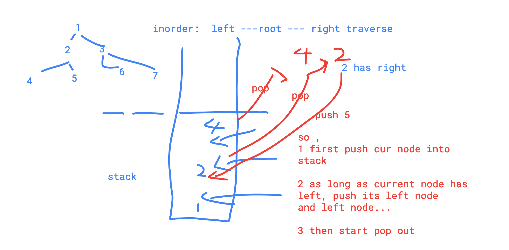

# 67. Binary Tree Inorder Traversal


#### Description

Given a binary tree, return the inorder traversal of its nodes' values.Have you met this question in a real interview?  YesProblem Correction

#### Example

Given binary tree `{1,#,2,3}`,

```text
   1
    \
     2
    /
   3
```

return `[1,3,2]`.

#### Challenge

Can you do it without recursion?

#### Related Problems

[915. Inorder Predecessor in BST](https://www.lintcode.com/problem/inorder-predecessor-in-bst)[902. Kth Smallest Element in a BST](https://www.lintcode.com/problem/kth-smallest-element-in-a-bst)[901. Closest Binary Search Tree Value II](https://www.lintcode.com/problem/closest-binary-search-tree-value-ii)[66. Binary Tree Preorder Traversal](https://www.lintcode.com/problem/binary-tree-preorder-traversal)

```cpp
/**
 * Definition for a binary tree node.
 * type TreeNode struct {
 *     Val int
 *     Left *TreeNode
 *     Right *TreeNode
 * }
 */

/**
 * @param root: A Tree
 * @return: Inorder in ArrayList which contains node values.
 */
func inorderTraversal (root *TreeNode) []int {
    // write your code here
    //left, root,Right
    
    var res []int
    
    if root == nil{
        res = make([]int,0) //a slice with zero size
        return res
    }
    
    if root.Left != nil{
        res = append(res,inorderTraversal(root.Left)...)
    }
    
    res = append(res, root.Val)
    
    if root.Right  != nil{
          res = append(res,inorderTraversal(root.Right)...)      
    }
    return res
}

```

using the 'stack', we can also traverse the binary tree in order.



```cpp
/**
 * Definition for a binary tree node.
 * type TreeNode struct {
 *     Val int
 *     Left *TreeNode
 *     Right *TreeNode
 * }
 */

/**
 * @param root: A Tree
 * @return: Inorder in ArrayList which contains node values.
 */
func inorderTraversal (root *TreeNode) []int {
    // write your code here
    
    var stack []*TreeNode
    cur := root
    var result []int
    
    if root == nil{
        return make([]int,0)
    }
    
    for cur != nil || len(stack) > 0{
        for cur != nil{
            stack = append(stack,cur)
            cur = cur.Left
        }
        
        cur = stack[len(stack) - 1]
        stack = stack[:len(stack) - 1]
        result = append(result,cur.Val)
        cur = cur.Right
    }
    return result
}

```

better version

```go
/**
 * Definition for a binary tree node.
 * type TreeNode struct {
 *     Val int
 *     Left *TreeNode
 *     Right *TreeNode
 * }
 */

/**
 * @param root: A Tree
 * @return: Inorder in ArrayList which contains node values.
 */

func helper(ret *[]int, root *TreeNode){
    if root == nil{
        return
    }
    helper(ret, root.Left)
    (*ret) = append((*ret),root.Val)
    helper(ret,root.Right)
}

func inorderTraversal (root *TreeNode) []int {
    // write your code here
    ret := make([]int,0)
    helper(&ret,root)
    return ret
}

```

