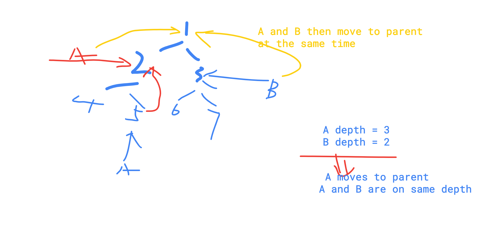

# All Lowest Common Ancestor

#### Description

Given the root and two nodes in a Binary Tree. Find the lowest common ancestor\(LCA\) of the two nodes.

The lowest common ancestor is the node with largest depth which is the ancestor of both nodes.

Assume two nodes are exist in tree.Have you met this question in a real interview?  YesProblem Correction

#### Example

For the following binary tree:

```text
  4
 / \
3   7
   / \
  5   6
```

LCA\(3, 5\) = `4`

LCA\(5, 6\) = `7`

LCA\(6, 7\) = `7`

#### Related Problems

[578. Lowest Common Ancestor III](https://www.lintcode.com/problem/lowest-common-ancestor-iii)[474. Lowest Common Ancestor II](https://www.lintcode.com/problem/lowest-common-ancestor-ii)

```cpp
/**
 * Definition of TreeNode:
 * class TreeNode {
 * public:
 *     int val;
 *     TreeNode *left, *right;
 *     TreeNode(int val) {
 *         this->val = val;
 *         this->left = this->right = NULL;
 *     }
 * }
 */


class Solution {
public:
    /*
     * @param root: The root of the binary search tree.
     * @param A: A TreeNode in a Binary.
     * @param B: A TreeNode in a Binary.
     * @return: Return the least common ancestor(LCA) of the two nodes.
     */
    TreeNode * lowestCommonAncestor(TreeNode * root, TreeNode * A, TreeNode * B) {
        // write your code here
        if (root == nullptr || A == root || B == root) return root;
        
        TreeNode* left = lowestCommonAncestor(root->left,A, B);
        TreeNode* right = lowestCommonAncestor(root->right,A,B);
        
        if (left && right) return root;
        if (left) return left;
        if (right) return right;
    }
};
```

II LCA II

each node has parent node,



```cpp
/**
 * Definition of ParentTreeNode:
 * class ParentTreeNode {
 * public:
 *     int val;
 *     ParentTreeNode *parent, *left, *right;
 * }
 */


class Solution {
public:
    int depth(ParentTreeNode* node){
        int d = 0;
        while(node != nullptr){
            node = node->parent;
            d++;
        }
        return d;
    }
    
    /*
     * @param root: The root of the tree
     * @param A: node in the tree
     * @param B: node in the tree
     * @return: The lowest common ancestor of A and B
     */
    ParentTreeNode * lowestCommonAncestorII(ParentTreeNode * root, ParentTreeNode * A, ParentTreeNode * B) {
        // write your code here
        if (root == nullptr || root == A || root == B) return root;
        
        int aDepth = depth(A);
        int bDepth = depth(B);
        
        ParentTreeNode* n1 = A;
        ParentTreeNode* n2 = B;
        
        while( aDepth > bDepth){
            n1 = n1->parent;
            aDepth--;
        }
        while(aDepth < bDepth){
            n2 = n2->parent;
            bDepth--;
        }
        
        while (n1 != n2){
            n1 = n1->parent;
            n2 = n2->parent;
        }
        return n1;
    }
};
```

#### Description

中文English

Given the root and two nodes in a Binary Tree. Find the lowest common ancestor\(LCA\) of the two nodes.

The lowest common ancestor is the node with largest depth which is the ancestor of both nodes.

Assume two nodes are exist in tree.Have you met this question in a real interview?  YesProblem Correction

#### Example

For the following binary tree:

```text
  4
 / \
3   7
   / \
  5   6
```

LCA\(3, 5\) = `4`

LCA\(5, 6\) = `7`

LCA\(6, 7\) = `7`

```cpp
/**
 * Definition of TreeNode:
 * class TreeNode {
 * public:
 *     int val;
 *     TreeNode *left, *right;
 *     TreeNode(int val) {
 *         this->val = val;
 *         this->left = this->right = NULL;
 *     }
 * }
 */


class Solution {
public:
    /*
     * @param root: The root of the binary search tree.
     * @param A: A TreeNode in a Binary.
     * @param B: A TreeNode in a Binary.
     * @return: Return the least common ancestor(LCA) of the two nodes.
     */
    TreeNode * lowestCommonAncestor(TreeNode * root, TreeNode * A, TreeNode * B) {
        // write your code here
        if (root == nullptr || A == root || B == root) return root;
        
        TreeNode* left = lowestCommonAncestor(root->left,A, B);
        TreeNode* right = lowestCommonAncestor(root->right,A,B);
        
        if (left && right) return root;
        if (left) return left;
        if (right) return right;
    }
};
```

```cpp
/**
 * Definition of TreeNode:
 * class TreeNode {
 * public:
 *     int val;
 *     TreeNode *left, *right;
 *     TreeNode(int val) {
 *         this->val = val;
 *         this->left = this->right = NULL;
 *     }
 * }
 */


class Solution {
public:
    bool findnode(TreeNode* root, TreeNode* n){
        if (root == nullptr) return false;
        if (root == n) return true;
        return findnode(root->left,n) | findnode(root->right,n);
    }
    /*
     * @param root: The root of the binary tree.
     * @param A: A TreeNode
     * @param B: A TreeNode
     * @return: Return the LCA of the two nodes.
     */
    TreeNode * lowestCommonAncestor3(TreeNode * root, TreeNode * A, TreeNode * B) {
        // write your code here
        if (root == nullptr) return root;
        if (findnode(root,A) == false || findnode(root,B) == false){
            return nullptr;
        }
        if (root == A ||  root == B) return root;
        TreeNode* left = lowestCommonAncestor3(root->left,A,B);
        TreeNode* right = lowestCommonAncestor3(root->right,A,B);
        if (left == nullptr && right == nullptr) return root;
        if (left) return left;
        if (right) return right;
    }
};
```

