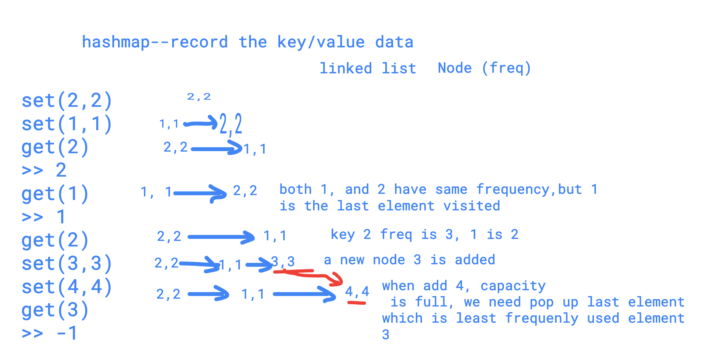
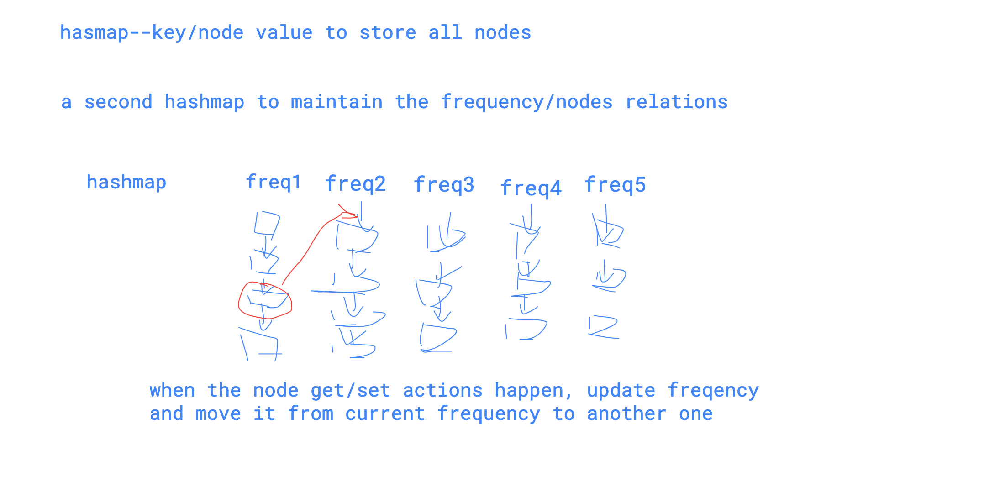

# 134 LRU cache && LFU cache

Description

中文English

Design and implement a data structure for Least Recently Used \(LRU\) cache. It should support the following operations: `get` and `set`.

`get(key)` - Get the value \(will always be positive\) of the key if the key exists in the cache, otherwise return -1.  
`set(key, value)` - Set or insert the value if the key is not already present. When the cache reached its capacity, it should invalidate the least recently used item before inserting a new item.Have you met this question in a real interview?  YesProblem Correction

#### Example

**Example1**

```text
Input:
LRUCache(2)
set(2, 1)
set(1, 1)
get(2)
set(4, 1)
get(1)
get(2)
Output:
[1,-1,1]

```

every time we need to get or set, we need to update linked list.

```cpp
#include <list>
using namespace std;

class LRUCache {
public:
    
    map<int,int> record;
    int size;
    std::list<int> dataList;
    int curSize;
    
    /*
    * @param capacity: An integer
    */LRUCache(int capacity) {
        // do intialization if necessary
        size = capacity;
        curSize = 0;
    }
    
    /*
     * @param key: An integer
     * @return: An integer
     */
    int get(int key) {
        // write your code here
        if (record.find(key) == record.end()) return -1;
        dataList.remove(key);
        dataList.push_front(key);
        return record[key];
    }

    /*
     * @param key: An integer
     * @param value: An integer
     * @return: nothing
     */
    void set(int key, int value) {
        // write your code here
        if (record.find(key) == record.end()){
            record[key] = value;
            dataList.push_front(key);
            curSize++;
        }else{
            record[key] = value;
            dataList.remove(key);
            dataList.push_front(key);
        }
        
        if (curSize > size){
            int last = dataList.back();
            record.erase(last);
            curSize--;
            dataList.pop_back();
        }
    }
};
```

LFU cache \(least frequently used\)


#### Description

中文English

LFU \(Least Frequently Used\) is a famous cache eviction algorithm.

For a cache with capacity _k_, if the cache is full and need to evict a key in it, the key with the lease frequently used will be kicked out.

Implement `set` and `get` method for LFU cache.Have you met this question in a real interview?  YesProblem Correction

#### Example

Given `capacity=3`

```text
set(2,2)
set(1,1)
get(2)
>> 2
get(1)
>> 1
get(2)
>> 2
set(3,3)
set(4,4)
get(3)
>> -1
get(2)
>> 2
get(1)
>> 1
get(4)
>> 4
```

Several ways




```cpp
#include <list>
using namespace std;

class LFUCache {
public:

    struct Node{
        int key;
        int value;
        int freq;
        Node(){
        }
        Node(int k, int v, int f){
            key = k;
            value = v;
            freq = f;
        }
    };

    int capSize;
    map<int,Node> record;
    std::list<Node> nodes;

    /*
    * @param capacity: An integer
    */LFUCache(int capacity) {
        // do intialization if necessary
        capSize = capacity;
    }
    
    void insert(Node& n){
        bool insert = true;
        for (auto i = nodes.begin(); i != nodes.end(); i++){
            if (n.freq >= (*i).freq){
                insert = false;
                nodes.insert(i,n);
                break;
            }
        }
        
        if (insert){
            nodes.push_back(n);   
        }        
    }
    
    /*
     * @param key: An integer
     * @param value: An integer
     * @return: nothing
     */
    void set(int key, int value) {
        // write your code here
        if (record.find(key) == record.end()){
            Node n(key,value,1);
            record[key] = n;
            
            if (record.size() > capSize){
                Node last = nodes.back();
                nodes.pop_back();
                record.erase(last.key);
                insert(n);
            }else{
                insert(n);
            }
        }else{
            Node& n = record[key];
            n.freq++;
            n.value = value;
            for (auto i = nodes.begin(); i != nodes.end(); i++){
                if ((*i).key == key){
                    nodes.erase(i);
                    break;
                }
            }
            insert(n);
        }
    }

    /*
     * @param key: An integer
     * @return: An integer
     */
    int get(int key) {
        // write your code here
        if (record.find(key) == record.end()) return -1;
        Node& n = record[key];
        
        for (auto i = nodes.begin(); i != nodes.end(); i++){
            if ((*i).key == key){
                nodes.erase(i);
                break;
            }
        }
        
        n.freq++;
        Node node(n.key,n.value,n.freq);
        insert(n);
        
        return n.value;
    }
};
```

hashmap to recored the frequency and nodes relations



```cpp
class LFUCache {
public:

    struct Node{
        int key;
        int value;
        int freq;
        Node(){
        }
        Node(int k, int v, int f){
            key = k;
            value = v;
            freq = f;
        }
    };

    int capSize;
    map<int,Node> record;
    map<int,std::vector<Node>> freqData;
    
    /*
    * @param capacity: An integer
    */LFUCache(int capacity) {
        // do intialization if necessary
        capSize = capacity;
    }
    
    void removeLeastUsed(){
        int minFreq = INT_MAX; 
        for (auto p : freqData){
            
            //make sure the value of list is not empty
            if (minFreq > p.first && p.second.size() > 0){
                minFreq = p.first;
            }
        }
        vector<Node>& nodes = freqData[minFreq];
        Node& last = nodes.back();        
        record.erase(last.key);
        nodes.pop_back();
    }
    
    void removeNodeFromFreqData(Node& n){
        vector<Node>& nodes = freqData[n.freq];
        for (int i = 0; i < nodes.size(); i++){
            if (nodes[i].key == n.key){
                nodes.erase(nodes.begin() + i);
                break;
            }
        }
    }
    
    /*
     * @param key: An integer
     * @param value: An integer
     * @return: nothing
     */
    void set(int key, int value) {
        // write your code here
        if (record.find(key) == record.end()){
            Node n (key,value,1);
            record[key] = n;
            
            if (record.size() > capSize) {
                removeLeastUsed();
            }

            vector<Node>& freqNodes = freqData[1];
            freqNodes.insert(freqNodes.begin(),n);

        }else{
             Node& n = record[key];
             n.value = value;
             removeNodeFromFreqData(n);
             n.freq++;
             vector<Node>& nodes = freqData[n.freq];
             nodes.insert(nodes.begin(),n);
             freqData[n.freq] = nodes;
        }
    }

    /*
     * @param key: An integer
     * @return: An integer
     */
    int get(int key) {
        // write your code here
        if (record.find(key) == record.end()) return -1;
        Node& n = record[key];
        
        vector<Node>& nodes = freqData[n.freq];
        for(int i = 0; i < nodes.size();i++){
            if (nodes[i].key == key) {
                nodes.erase(nodes.begin() + i);
                break;
            }
        }
        
        n.freq++;
        vector<Node>& freqNodes = freqData[n.freq];
        freqNodes.insert(freqNodes.begin(),n);
        
        return n.value;
    }
};
```

