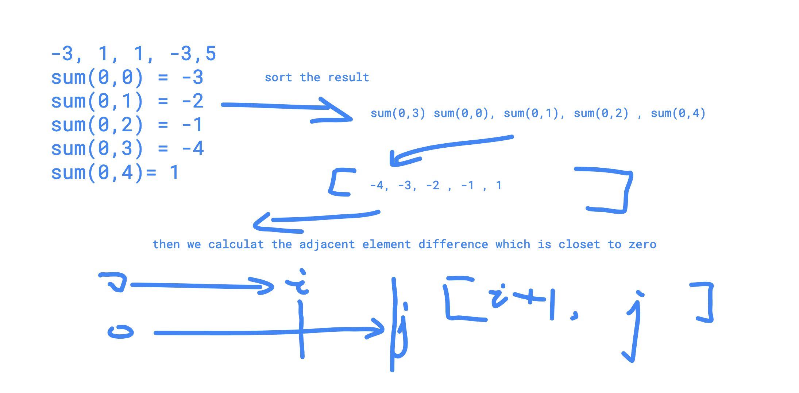

# 139 Subarray Sum Closest

#### Description

Given an integer array, find a subarray with sum closest to zero. Return the indexes of the first number and last number.Have you met this question in a real interview?  YesProblem Correction

#### Example

Given `[-3, 1, 1, -3, 5]`, return `[0, 2]`, `[1, 3]`, `[1, 1]`, `[2, 2]` or `[0, 4]`.

#### Challenge

O\(nlogn\) time

#### Related Problems

Notes:

challenge is O\(nlogn\), we need to think about the 'sort' algorithm

1. we calculate the sum\(0,i\), and save the result.
2. we sort the subarray sum by its value. 

so the closet the subarray problem is converted to find the closest 

adjacent element in a sorted array.

for example,



be noticed that if sum \(j\) - sum\(i\) is closet to zero,  the start index

should be \[i + 1, j\] which is the closet value.


```cpp
class Solution {
public:

    struct node{
        int val;
        int index;
        node(int s, int pos):val(s),index(pos){}
    };
    
    static bool comp(node& a, node& b){
        if (a.val < b.val) return true;
        if (a.val == b.val){
            return a.index < b.index;
        }
        return false;
    }
    /*
     * @param nums: A list of integers
     * @return: A list of integers includes the index of the first number and the index of the last number
     */
    vector<int> subarraySumClosest(vector<int> &nums) {
        // write your code here
        
        vector<node> sum(nums.size(),node{0,0});
        int tmp = 0;
        vector<int> res(2,0);
        
        for (int i = 0; i < nums.size(); i++){
            tmp += nums[i];
            if (tmp == 0){
                res[0] = 0;
                res[1] = i;
                return res;
            }
            struct node n(tmp,i);
            sum[i] = n;
        }
        
        sort(sum.begin(),sum.end(),comp);
        int ans = INT_MAX;
        
        for (int i = 1 ; i < sum.size(); i++){
            int diff = abs(sum[i].val - sum[i-1].val);
            if (diff < ans){
                ans = diff;
                res[0] = min(sum[i].index,sum[i-1].index) + 1;
                res[1] = max(sum[i].index,sum[i-1].index) ;
            }
        }
        return res;
    }
};
```


