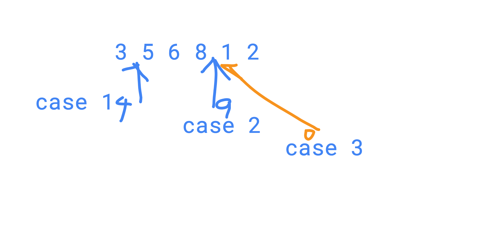

# 599. Insert into a Cyclic Sorted List

#### Description

Given a node from a cyclic linked list which has been sorted, write a function to insert a value into the list such that it remains a cyclic sorted list. The given node can be any single node in the list. Return the inserted new node.

`3->5->1` is a cyclic list, so `3` is next node of `1`.  
`3->5->1` is same with `5->1->3`Have you met this question in a real interview?  YesProblem Correction

#### Example

Given a list, and insert a value `4`:  
`3->5->1`  
Return `5->1->3->4`

`Note:`

There are several edge cases need to be considered.

Also, we need to find the maximum node \( if its next node value is smaller, then current node must be maximum node\).

Two different ways:

1 .Find the start position of the node in this list, the minimum node position, and then iterate 

2 without find the start position, there are three cases

a.  new node is larger than current node, and smaller than next node

a. new node is the largest node 

a. new node is the smallest node



```cpp
/**
 * Definition of ListNode
 * class ListNode {
 * public:
 *     int val;
 *     ListNode *next;
 *     ListNode(int val) {
 *         this->val = val;
 *         this->next = NULL;
 *     }
 * }
 */


class Solution {
public:
    /*
     * @param node: a list node in the list
     * @param x: An integer
     * @return: the inserted new list node
     */
    ListNode * insert(ListNode * node, int x) {
    
        // write your code here
        ListNode* res = new ListNode(x);
        
        //special case
        if (node == nullptr){
            res->next = res;
            return res;
        }
        
        //find the minimum node position
        ListNode* prev = nullptr;
        ListNode* min = nullptr;
        ListNode* max = node;
        
        ListNode* cur = node->next;
        
        //we should find the max node, max->next must be min node
        while(cur != node){
            if (cur->val > cur->next->val){
                max = cur;
                break;
            }else{
                cur = cur->next;
            }
        }
        min = max->next;
        
        if (x <= min->val || x >= max->val){
            res->next = min;
            max->next = res;
            return res;
        }else{
            
            ListNode* prev = min;
            ListNode* cur = min->next;
            
            while(cur != nullptr && cur != min){
                if (x <= cur->val){
                    res->next = cur;
                    prev->next = res;
                    return res;
                }
                prev = cur;
                cur = cur->next;
            }
        }
        return res;
    }
};
```


```cpp
/**
 * Definition of ListNode
 * class ListNode {
 * public:
 *     int val;
 *     ListNode *next;
 *     ListNode(int val) {
 *         this->val = val;
 *         this->next = NULL;
 *     }
 * }
 */


class Solution {
public:
    /*
     * @param node: a list node in the list
     * @param x: An integer
     * @return: the inserted new list node
     */
    ListNode * insert(ListNode * node, int x) {
        // write your code here
        ListNode* n = new ListNode(x);
        
        if (node == nullptr){
            n->next = n;
            return n;
        }
        
        ListNode* start = node;
        ListNode* cur = node;
        ListNode* next = cur->next;
        
        while(start != next){
            if (n->val >= cur->val && n->val <= next->val ||
            n->val < cur->val && n->val < next->val && next->val < cur->val||
            n->val > cur->val && n->val > next->val && next->val <
            cur->val){
                cur->next = n;
                n->next = next;
                return n;
            }
            cur = cur->next;
            next= cur->next;
        }
        cur->next = n;
        n->next = next;
        return n;
    }
};
```

