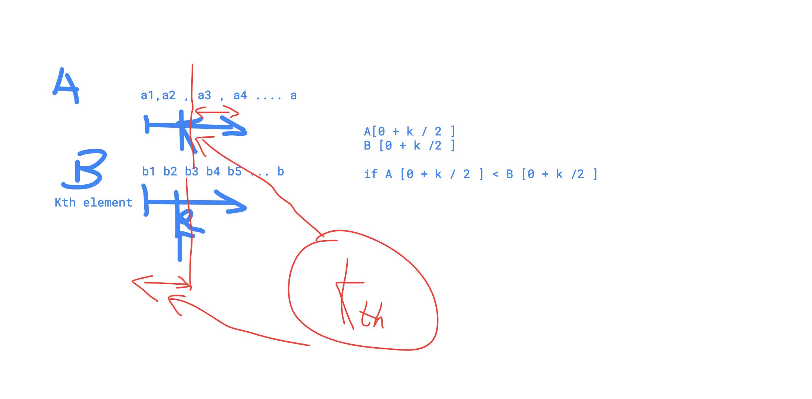

# Back 65. Median of two Sorted Arrays

There are two sorted arrays _A_ and _B_ of size _m_ and _n_ respectively. Find the **median** of the two sorted arrays.Have you met this question in a real interview?  YesProblem Correction

#### Example

Given `A=[1,2,3,4,5,6]` and `B=[2,3,4,5]`, the median is `3.5`.

Given `A=[1,2,3]` and `B=[4,5]`, the median is `3`.

#### Challenge

The overall run time complexity should be `O(log (m+n))`.

Notes:

Solution 1, merge two linked list , and get the medium value of sorted array

Solution 2, to make sure the time complexity is O\(log\(m+n\)\), we should calculate the medium without the merge

solution 1

```cpp
class Solution {
public:
    /*
     * @param A: An integer array
     * @param B: An integer array
     * @return: a double whose format is *.5 or *.0
     */
    double findMedianSortedArrays(vector<int> &A, vector<int> &B) {
        
        int a = A.size();
        int b = B.size();
        vector<int> res(a+b,0);
        
        int pos = a + b -1;
        int i= a - 1;
        int j = b -1;
        int target = (a+b)/2;
        
        while(i >=0 && j >=0){
            
            if (A[i] > B[j]){
                res[pos] = A[i];
                i--;
            }else{
                res[pos] = B[j];
                j--;
            }
            
            pos--;
        }
        
        while (i >=0){
            res[pos] = A[i];
            i--;
            pos--;
        }
        
        while (j >=0){
            res[pos] = B[j];
            j--;
            pos--;
        }        
        
        if ((a+b) %2  == 0){
            
            if (target-1 >= 0){
                return double(res[target] + res[target-1])/2;
            }else{
                return res[target];
            }
            
        }else{
            return res[target];
        }
    }
};
```

solution 2 divide and conquer



```cpp
class Solution {
public:

    //find the Kth element
    double findK(vector<int>& A, int startA,vector<int>& B, int startB, int k ){
        if (startA >= A.size()){
            return B[startB + k - 1];
        }
        if (startB >= B.size()){
            return A[startA + k - 1];
        }
        if (k == 1){
            return min(A[startA],B[startB]);
        }
        
        int halfKthOfA = startA + k / 2 - 1 < A.size()
            ? A[startA + k / 2 - 1]
            : INT_MAX;
        int halfKthOfB = startB + k / 2 - 1 < B.size()
            ? B[startB + k / 2 - 1]
            : INT_MAX; 
        
        //we want to find the Kth element in a sorted array
        //if A[] the half of K pos is less than B half of
        //k, the Kth must be on the right half of A and B
        if (halfKthOfA < halfKthOfB) {
            return findK(A, startA + k / 2, B, startB, k - k / 2);
        } else {
            return findK(A, startA, B, startB + k / 2, k - k / 2);
        }
    }
    
    /*
     * @param A: An integer array
     * @param B: An integer array
     * @return: a double whose format is *.5 or *.0
     */
    double findMedianSortedArrays(vector<int> &A, vector<int> &B) {
        // write your code here
        int n = A.size() + B.size();
        
        if (n %2 == 0){
            double d1 = findK(A,0,B,0, n/2);
            double d2 = findK(A,0,B,0, n/2 + 1);
            return (d1 + d2) /2 ;
        }
        
        return findK(A, 0, B, 0, n / 2 + 1);
    } 
};
```

for example,  we need to find 4th element,  element must be A \[0-4\], and B \[0-4\] range, 

further more, 4th element from A or B, if A\[0,2\] is less than B\[0,2\], meaning the 4th element is definitely not within A\[0,2\]


