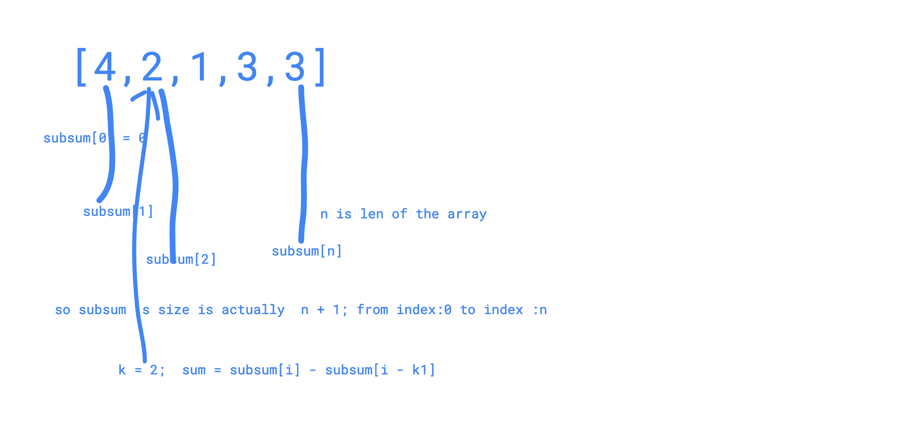

# Maximum Average Subarray II

Maximum Average Subarray

Description

Given an array consisting of `n` integers, find the contiguous subarray of given length `k` that has the maximum average value. You need to output the maximum average value.

1. `1 <= k <= n <= 30,000`.
2. Elements of the given array will be in the range `[-10,000, 10,000]`.

Have you met this question in a real interview?  YesProblem Correction

#### Example

**Example1**

```text
Input:  nums = [1,12,-5,-6,50,3] and k = 4
Output: 12.75
Explanation:
Maximum average is (12-5-6+50)/4 = 51/4 = 12.75
```

**Example2**

```text
Input:  nums = [4,2,1,3,3] and k = 2
Output: 3.00
Explanation:
Maximum average is (3+3)/2 = 6/2 = 3.00
```

/\*\*

* @param nums: an array
* @param k: an integer
* @return: the maximum average value

  \*/

func findMaxAverage \(nums \[\]int, k int\) float64 { // Write your code here

typical 'window slide'

```cpp
if len(nums) == 0  || k <= 0 || k > len(nums){
    return 0
}

total := 0
for i := 0; i < k && i < len(nums); i++{
    total += nums[i]
}

ret := float64(total)/float64(k)


for i := 1; i + k - 1 < len(nums); i++{
    total = total - nums[i - 1] + nums[i+k - 1]
    tmp := float64(total)/float64(k)
    if tmp > ret{
        ret = tmp
    }
}
return ret
```

}


second way is to calculate the sub sum of the array, 

subsum\[0\] = 0 

subsum\[1\] = subsum\[0\] + nums\[0\]

subsum\[i\] = subsum\[i-1\] + nums\[i -1\]

means the i-th the sub sum of the array is the previous subsum + nums\[i -1\]



```cpp
/**
 * @param nums: an array
 * @param k: an integer
 * @return: the maximum average value
 */
 
func findMaxAverage (nums []int, k int) float64 {
    // Write your code here
    
    if len(nums) ==0 || k > len(nums){
        return 0
    }
    
    var subSum []int
    subSum = append(subSum,0)
    
    //[4,2,1,3,3]
    //sub sum:
    //0,4, 6,
    //subSum[1],2,3,4,5; k = 2
    for i := 1 ; i <= len(nums); i++{
        subSum = append(subSum, subSum[i-1]+ nums[i-1])
    }
    
    ans := 0
    for i:=k; i <= len(nums); i++{
        if (subSum[i] - subSum[i-k]) > ans{
            ans = subSum[i] - subSum[i-k]
        }
    }
    
    return float64(ans)/float64(k)
}

```

#### Description

Given an array with positive and negative numbers, find the `maximum average subarray` which length should be greater or equal to given length `k`.

It's guaranteed that the size of the array is greater or equal to _k_.Have you met this question in a real interview?  YesProblem Correction

#### Example

Example 1:

```text
Input:
[1,12,-5,-6,50,3]
3
Output:
15.667
Explanation:
 (-6 + 50 + 3) / 3 = 15.667
```

Example 2:

```text
Input:
[5]
1
Output:
5.000
```


