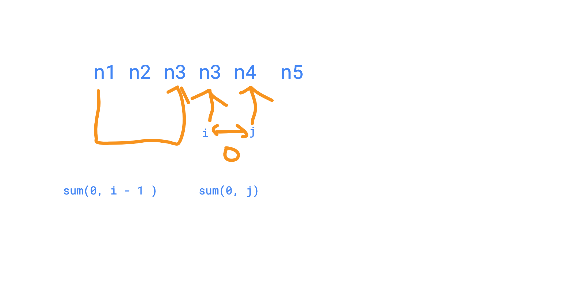

# 138. Subarray Sum


#### Description

Given an integer array, find a subarray where the sum of numbers is **zero**. Your code should return the index of the first number and the index of the last number.

There is at least one subarray that it's sum equals to zero.Have you met this question in a real interview?  YesProblem Correction

#### Example

Note:

```cpp
        hash[0] = -1;
```

```text
Example 1:
	Input:  [-3, 1, 2, -3, 4]
	Output: [0, 2] or [1, 3].
	
	Explanation:
	return anyone that the sum is 0.

Example 2:
	Input:  [-3, 1, -4, 2, -3, 4]
	Output: [1,5]
```

```cpp
class Solution {
public:
    /**
     * @param nums: A list of integers
     * @return: A list of integers includes the index of the first number and the index of the last number
     */
    vector<int> subarraySum(vector<int> &nums) {
        // write your code here
        
        //[-3, 1, 2, -3, 4]
        unordered_map<int, int> hash;
        
        int sum = 0;
        hash[0] = -1;
        for (int i = 0; i < nums.size(); i++) {
            sum += nums[i];
            if (hash.find(sum) != hash.end()) {
                vector<int> result;
                result.push_back(hash[sum] + 1);
                result.push_back(i);
                return result;
            }
            hash[sum] = i;
        }
        
        vector<int> result;
        return result;
    }
};
```



suppose we find the index i and j , that sum\(i j \) = 0;

then sum\(0, i - 1 \)  = sum\(0, j\) 

so we actually just need to calculate the subarray sum from index 0

to i.


```go
class Solution {
public:
    /**
     * @param nums: A list of integers
     * @return: A list of integers includes the index of the first number and the index of the last number
     */
    vector<int> subarraySum(vector<int> &nums) {
        map<int,int> data;
        vector<int> ret;
        int tmp = 0;
        
        for (int i= 0; i < nums.size(); i++){
            tmp += nums[i];
            
            if (tmp == 0){
                ret.push_back(0);
                ret.push_back(i);
                return ret;
            }
            
            if (data.find(tmp) != data.end()){
                ret.push_back(data[tmp] + 1);
                ret.push_back(i);   
                return ret;
            }
            data[tmp] = i;
        }
        return ret;
    }
};
```

