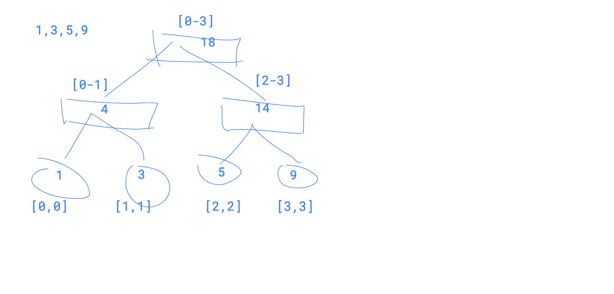
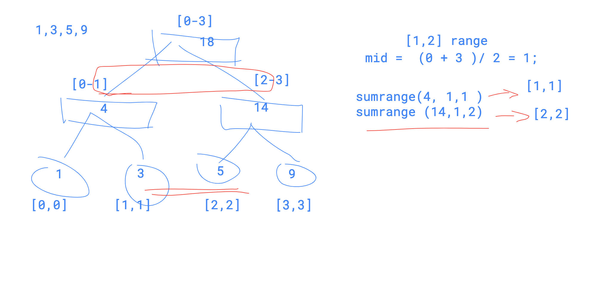

# 307. Range Sum Query - Mutable


#### 307. Range Sum Query - Mutable

[Description](https://leetcode.com/problems/range-sum-query-mutable/description/)[Hints](https://leetcode.com/problems/range-sum-query-mutable/hints/)[Submissions](https://leetcode.com/problems/range-sum-query-mutable/submissions/)[Discuss](https://leetcode.com/problems/range-sum-query-mutable/discuss/)[Solution](https://leetcode.com/problems/range-sum-query-mutable/solution/)[Pick One](https://leetcode.com/problems/random-one-question/)

Given an integer array nums, find the sum of the elements between indices i and j \(i ≤ j\), inclusive.

The update\(i, val\) function modifies nums by updating the element at index i to val.

**Example:**

```text
Given nums = [1, 3, 5]

sumRange(0, 2) -> 9
update(1, 2)
sumRange(0, 2) -> 8
```

**Note:**

1. The array is only modifiable by the update function.
2. You may assume the number of calls to update and sumRange function is distributed evenly.




build segment tree is a recursive process, we build from the leaf node firstly.

update node is also a recursive process, we update leaf node and then update the sum of parent node.

sum range we need to find the start node and end node, if the start and end value are equal to the target pair,  directly return, otherwise ,we need to recursively decide which side to iterate




