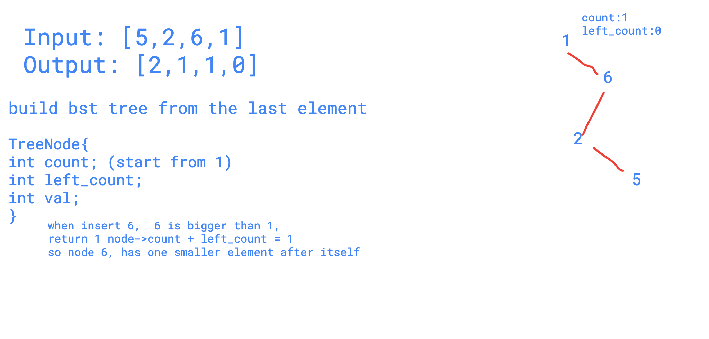

# 315. Count of Smaller Numbers After Self


You are given an integer array nums and you have to return a new counts array. The counts array has the property where `counts[i]` is the number of smaller elements to the right of `nums[i]`.

**Example:**

```text
Input: [5,2,6,1]
Output: [2,1,1,0] 
Explanation:
To the right of 5 there are 2 smaller elements (2 and 1).
To the right of 2 there is only 1 smaller element (1).
To the right of 6 there is 1 smaller element (1).
To the right of 1 there is 0 smaller element.
```

Seen this question in a real interview before?  YesNo


```text
class Solution {
public:
    struct TreeNode{
      TreeNode* left;
      TreeNode* right;
      int val;
      int count;
      int left_count;
      TreeNode(int v){
        val = v;
        left = right = nullptr;
        count = 1;   //node itself is taken as one
        left_count = 0;
      }
    };
  
   int insert(TreeNode* root, int val){
      if (!root) return 0;
     if (root->val == val){
      root->count++;
      return root->left_count;
    }else if (val < root->val){
       root->left_count++;
       if (root->left == nullptr){
         root->left = new TreeNode(val);
         return 0;
       }
       return insert(root->left,val);
     }else{
       if (root->right == nullptr){
         root->right = new TreeNode(val);
         return root->count + root->left_count;
       }
       return root->count + root->left_count + insert(root->right,val);
     } 
   }
  
    vector<int> countSmaller(vector<int>& nums) {
         reverse(nums.begin(), nums.end());
      TreeNode* root = new TreeNode(nums[0]);
      //reverse, make the last element in the nums as the root node
      //then construct a binary search treee
      //so when we insert the node to the tree, we know how many nodes
      //are compared
      vector<int> ans;
      ans.push_back(0);
      for(int i = 1; i < nums.size(); i++){
        int r = insert(root,nums[i]);
        ans.push_back(r);
      }
      reverse(ans.begin(),ans.end());
      return ans;     
    }
};
```



