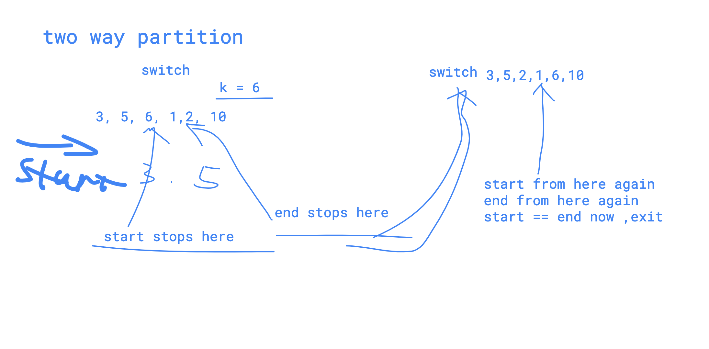

# 31&625 partition array


#### Description

Given an array `nums` of integers and an int `k`, partition the array \(i.e move the elements in "nums"\) such that:

* All elements &lt; _k_ are moved to the _left_
* All elements &gt;= _k_ are moved to the _right_

Return the partitioning index, i.e the first index _i_ nums\[_i_\] &gt;= _k_.

You should do really partition in array _nums_ instead of just counting the numbers of integers smaller than k.

If all elements in _nums_ are smaller than _k_, then return _nums.length_Have you met this question in a real interview?  YesProblem Correction

#### Example

Example 1:

```text
Input:
[],9
Output:
0

```

Example 2:

```text
Input:
[3,2,2,1],2
Output:1
Explanation:
the real array is[1,2,2,3].So return 1
```

#### Challenge

Can you partition the array in-place and in O\(n\)?

#### Related Problems

[769. Spiral Array](https://www.lintcode.com/problem/spiral-array)[761. Smallest Subset](https://www.lintcode.com/problem/smallest-subset)[625. Partition Array II](https://www.lintcode.com/problem/partition-array-ii)[373. Partition Array by Odd and Even](https://www.lintcode.com/problem/partition-array-by-odd-and-even)[144. Interleaving Positive and Negative Numbers](https://www.lintcode.com/problem/interleaving-positive-and-negative-numbers)[96. Partition List](https://www.lintcode.com/problem/partition-list)

Note: the if condition is i &lt;= j,  it is required to return first index of element which is &gt;=k.



```cpp
class Solution {
public:
    /**
     * @param nums: The integer array you should partition
     * @param k: An integer
     * @return: The index after partition
     */
    int partitionArray(vector<int> &nums, int k) {
        if (nums.size() == 0) return 0;
        int i = 0;
        int j = nums.size() - 1;
        
        while(i <= j){
            while(i <= j && nums[i] < k) i++;
            while(i <= j && nums[j] >= k) j--;
            
            while(i <= j ){
                int tmp = nums[i];
                nums[i] = nums[j];
                nums[j] = tmp;
                i++;
                j--;
            }
        }
        return i;
    }
};
```

```go
/**
 * @param nums: The integer array you should partition
 * @param k: An integer
 * @return: The index after partition
 */
func partitionArray (nums []int, k int) int {
    // write your code here
    if len(nums) == 0{
        return 0
    }
    
    start := 0
    end := len(nums) -1 
    
    for start <= end{
        
        for end >= 0 && nums[end]>= k{
            end--
        }
        
        for start < len(nums) && nums[start] < k {
            start++
        }
        
        for start <= end{
            nums[start],nums[end] = nums[end],nums[start]
            start++
            end--
        }
    }
    return start
}

```

#### \[LintCode\] 625 Partition Array II 解题报告

**Description**  
Partition an unsorted integer array into three parts:  
  
The front part &lt; low  
The middle part &gt;= low & &lt;= high  
The tail part &gt; high  
Return any of the possible solutions.  
  
  
**Notice**  
low &lt;= high in all testcases.  
  
**Example**  
Given \[4,3,4,1,2,3,1,2\], and low = 2 and high = 3.  
  
Change to \[1,1,2,3,2,3,4,4\].  
  
\(\[1,1,2,2,3,3,4,4\] is also a correct answer, but \[1,2,1,2,3,3,4,4\] is not\)


'i' points to the old array, basic idea is, 

if start &lt; i, we need to switch with i, i++, start++;

//start changes, i could change or not change position.

```go
// Given [4,3,4,1,2,3,1,2], and low = 2 and high = 3.
// Change to [1,1,2,3,2,3,4,4].
func partitionV2(nums []int, low int, high int) []int {

	if len(nums) == 0 {
		return nums
	}

	start := 0
	end := len(nums) - 1
	i := 0

	for start <= end {
		if nums[start] < low {
			nums[start], nums[i] = nums[i], nums[start]
			start++
			i++
		} else if nums[start] > high {
			nums[start], nums[end] = nums[end], nums[start]
			end--
		} else {
			start++
		}
	}
	return nums
}

```


