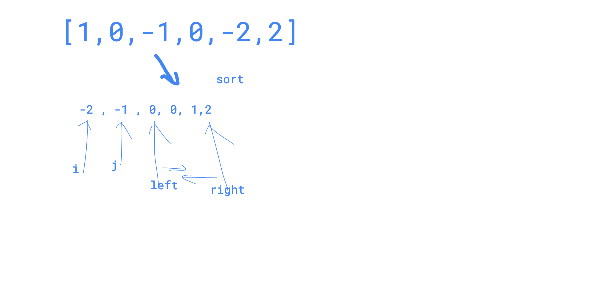

# 58 4sum


#### Description

中文English

Given an array _S_ of _n_ integers, are there elements _a_, _b_, _c_, and _d_ in _S_ such that _a + b + c + d = target_?

Find all unique quadruplets in the array which gives the sum of target.

Elements in a quadruplet \(_a,b,c,d_\) must be in non-descending order. \(ie, _a ≤ b ≤ c ≤ d_\)  
The solution set must not contain duplicate quadruplets.Have you met this question in a real interview?  YesProblem Correction

#### Example

Example 1:

```text
Input:[2,7,11,15],3
Output:[]

```

Example 2:

```text
Input:[1,0,-1,0,-2,2],0
Output:
[[-1, 0, 0, 1]
,[-2, -1, 1, 2]
,[-2, 0, 0, 2]]
```

sort the numbers of the array, firstly, and 

start from index i and j, then use  two pointers to find the other two index.

to remove duplicate result, it is similar as the 3sum.




```text
/**
 * @param numbers: Give an array
 * @param target: An integer
 * @return: Find all unique quadruplets in the array which gives the sum of zero
 */
import("sort") 
 
func fourSum (numbers []int, target int) [][]int {
    // write your code here
    sort.Ints(numbers)
    ret := make([][]int,0)
    
    for i := 0; i < len(numbers) -3 ; i++{
        
        for i != 0 && i < len(numbers) -3 && numbers[i] == numbers[i-1]{
            i++
        }
        
        for j := i + 1; j < len(numbers) - 2; j++{
            
            for j != i + 1 && j < len(numbers) - 2 && numbers[j] == numbers[j - 1]{
                j++
            }
            
            left := j + 1 
            right := len(numbers) - 1 
            
            for left < right{
                tmp := numbers[i] + numbers[j] + numbers[left]+numbers[right]
                if  tmp == target{
                    ret = append(ret,[]int{numbers[i],numbers[j],
                        numbers[left],numbers[right]})
                    left++
                    right--
                    for left < right && numbers[left] == numbers[left-1]{
                        left++
                    }
                    for left < right && numbers[right] == numbers[right+1]{
                        right--
                    }
                }else if tmp > target{
                    right--
                }else{
                    left++
                }
            }
        }
    }
    return ret
}

```

